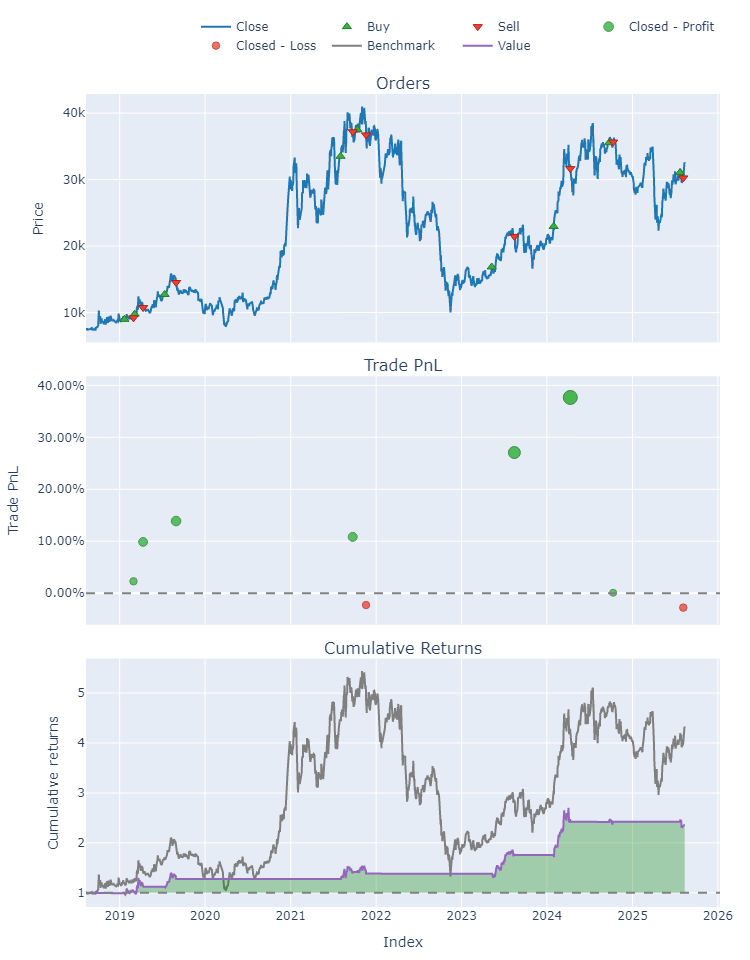

# Backtest tín hiệu MUA BÁN

## 1. Giới thiệu  
Dự án này thực hiện backtest tín hiệu MUA BÁN trong lịch sử, lọc được những mã CP phù hợp, ít rủi ro nhất, giảm bớt sự mù mờ khi phải chọn CP.  
Quy trình bao gồm:  
- Lọc danh sách cổ phiếu cần backtest.
- Backtest tín hiệu MUA BÁN của các mã đó trong lịch sử.
- Phân tích các chỉ số đánh giá như lợi nhuận, drawdown, tỷ lệ thắng, v.v.

## 2. Yêu cầu hệ thống  
- Python == 3.10  
- pip >= 21.2.4
- Hệ điều hành: Windows / macOS / Linux

## 3. Cài đặt thư viện  
Cài đặt toàn bộ thư viện cần thiết:  
```bash
pip install -r requirements.txt
```

## 4. Danh sách mã CP cần backtest

*Ví dụ*, cần backtest danh sách các mã CP thuộc nhóm VN200, tức là TOP 200 mã CP có vốn hóa lớn nhất.

Ví dụ code (minh họa ý tưởng lọc VN200):
```python
from helpers.vietcap import VietCapClient
vcsc = VietCapClient()
# tất cả các mã CP đang hoạt động
df_stocks = vcsc.get_stocks()
df_stocks.shape
# top 200 mã CP có vốn hóa lớn nhất
df_vn200 = (
    df_stocks
    .sort_values("ev", ascending=False)
    .head(200)
    .sort_values("ticker")
    .reset_index(drop=True)
    .loc[:,["ticker","exchange","closePrice","totalVolume","ev","pe","pb","roa","roe"]]
)
# -> Danh sách mã sẽ đem đi backtest
```

## 5. Backtest các mã cổ phiếu đã lọc

Sau khi đã lọc được danh sách các mã cổ phiếu cần backtest, tiến hành backtest để đánh giá hiệu quả của chiến lược.

### 5.1. Chuẩn bị dữ liệu
- Thu thập dữ liệu giá lịch sử (OHLCV) cho các mã cổ phiếu đã lọc, ví dụ từ năm 2016 đến nay.
- Đảm bảo dữ liệu đầy đủ để tính được tất cả các chỉ báo kỹ thuật sử dụng trong chiến lược (SMA10, SMA20, SMA50, SMA100, MACD, MACD Signal).
- Loại bỏ 100 phiên đầu tiên để tránh dữ liệu bị thiếu do tính SMA100.

### 5.2. Xây dựng tín hiệu giao dịch
- Sử dụng các điều kiện lọc tín hiệu MUA BÁN, áp dụng cho toàn bộ chuỗi thời gian.
- Tạo Series `entries` (tín hiệu MUA) và `exits` (tín hiệu BÁN) dựa trên chiến lược.

### 5.3. Backtest với `vectorbt`
Ví dụ:

```python
import vectorbt as vbt

pf = vbt.Portfolio.from_signals(
    close=df["close"],
    entries=df["buySignal"],
    exits=df["sellSignal"],
    size=1.0,       # mua toàn bộ vốn cho mỗi lệnh
    fees=0.001,     # phí giao dịch 0.1%
    freq="1D"
)
```

## 6. Phân tích kết quả
- Sử dụng hàm **pf.stats()** để xem các chỉ số hiệu suất:
  - **Total Return**: Tỷ suất lợi nhuận tổng cộng.
  - **Sharpe Ratio**: Đo lường lợi nhuận điều chỉnh theo rủi ro.
  - **Max Drawdown**: Mức sụt giảm tối đa từ đỉnh.
  - **Win Rate**: Tỷ lệ lệnh giao dịch có lợi nhuận.
  - **Profit Factor**: Tỷ số tổng lợi nhuận / tổng thua lỗ.
    |     | Start      | End        | Period             |   Start Value |   End Value |   Total Return [%] |   Max Drawdown [%] |   Profit Factor |   Sharpe Ratio |   Quality Score | Bucket   |
    |:----|:-----------|:-----------|:-------------------|--------------:|------------:|-------------------:|-------------------:|----------------:|---------------:|----------------:|:---------|
    | ABB | 2021-05-27 | 2025-08-19 | 1057 days 00:00:00 |           100 |       88.79 |             -11.21 |              12.65 |            0    |          -0.98 |               0 | Neutral  |
    | ACB | 2016-06-06 | 2025-08-19 | 2299 days 00:00:00 |           100 |      103.62 |               3.62 |              38.86 |            1.07 |           0.12 |               0 | Neutral  |
    | ACG | 2021-12-23 | 2025-08-19 | 902 days 00:00:00  |           100 |       97.21 |              -2.79 |               2.88 |            0    |          -0.72 |               0 | Neutral  |
    | ACV | 2017-04-18 | 2025-08-19 | 2085 days 00:00:00 |           100 |      271.01 |             171.01 |              15.05 |           12.14 |           1.34 |               7 | Strong   |
    | AGR | 2016-06-06 | 2025-08-19 | 2303 days 00:00:00 |           100 |      100.69 |               0.69 |              51.17 |            1.01 |           0.11 |               0 | Neutral  |

- Sử dụng **pf.plot().show()** để trực quan hóa đường vốn (equity curve) và các lệnh giao dịch trên biểu đồ. *Ví dụ*, mã **GVR**

    

## 7. Diễn giải

Với ví dụ backtest VN200, tính đến hết phiên giao dịch 19/08/2025, có:
- 24 mã CP **triển vọng**: ACV, ANV, BCM, BIC, CTD, CTR, DHT, GEG, GVR, HUT, KDC, MBB, ORS, PDR, SHS, SSI, STB, TMS, VCR, VGI, VIB, VIC, VND, VPB
- 06 mã CP **bỏ qua**    : DSC, HHV, MPC, PDN, SJG, TCB
- 58 mã CP **theo dõi**  : ABB, ACB, ACG, AGR, BID, BSR, BVH, CC1, CHP, CMG, CTG, DBD, DPM, DXG, FTS, HAG, HCM, HDC, HHS, HPG, IDC, IDP, IMP, KBC, KLB, KSF, LPB, MSB, MWG, NKG, NVB, NVL, PAN, PAP, PGV, POW, SAS, SCG, SCS, SGB, SJS, SSB, SSH, TID, TIN, TLG, TMP, VAB, VBB, VCS, VDS, VEA, VEF, VHM, VIF, VJC, VSH, VTP